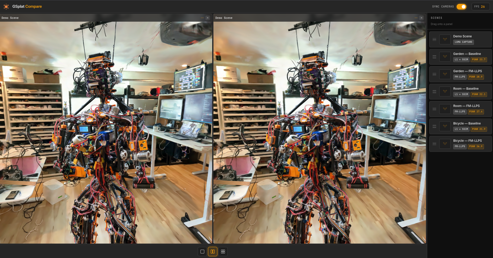

# GSplat Compare

A professional **3D Gaussian Splatting comparison viewer** built with [Three.js](https://threejs.org/) and [Luma Web](https://github.com/lumaai/luma-web). Load and compare multiple splat scenes side-by-side with synchronized cameras — perfect for evaluating rendering quality between different training configurations (e.g. Baseline vs FM-LLPS).



---

## Features

- 🖼 **Flexible layouts** — Single, vertical split (2-panel), or quad grid (4-panel)
- 🖱 **Drag & Drop loading** — Drag scene cards from the sidebar onto any panel
- 🔄 **Synchronized cameras** — Orbit in one panel and all others follow in real time (toggle on/off)
- 📊 **Metric badges** — PSNR, SSIM, FM-LLPS scores displayed per panel
- 🌑 **Dark mode by default** — Premium dark theme with OKLCH color system
- ⚡ **Vite + pnpm** — Fast dev server with HMR

---

## Tech Stack

| Layer | Library |
|---|---|
| 3D Rendering | [Three.js](https://threejs.org/) |
| Splat Loader | [@lumaai/luma-web](https://github.com/lumaai/luma-web) |
| Camera Controls | `three/examples/jsm/controls/OrbitControls` |
| Bundler | [Vite](https://vitejs.dev/) |
| Styling | Vanilla CSS + [Tailwind CSS v4](https://tailwindcss.com/) |
| Package Manager | [pnpm](https://pnpm.io/) |

---

## Getting Started

### Prerequisites

- Node.js ≥ 18
- pnpm (`npm install -g pnpm`)

### Install & Run

```bash
# Clone the repo
git clone https://github.com/your-username/gsplat-web.git
cd gsplat-web

# Install dependencies
pnpm install

# Start the dev server
pnpm run dev
```

Open [http://localhost:5173](http://localhost:5173) in your browser.

---

## Registering Scenes

There are two ways to add scenes.

### Option 1 — In-App Registration (localStorage)

Click **+ Add Scene** at the bottom of the sidebar to open the registration form. Fill in:

| Field | Required | Description |
|---|---|---|
| Scene Name | ✅ | Displayed on the card and panel label |
| Model / Loss | ✅ | Training configuration (autocompleted suggestions available) |
| Tag | — | Short uppercase tag, auto-derived if blank |
| Luma Capture URL | ✅ | `https://lumalabs.ai/capture/<id>` |
| PSNR / SSIM / FM-LLPS | — | Metric values from your evaluation |

Scenes added this way are stored in **`localStorage`** under the key `gsplat_custom_scenes`. They persist across page refreshes but are **browser-local** — clearing browser data or switching devices will remove them. Custom scene cards show a 🗑 delete button on hover.

### Option 2 — Hardcode in `src/config.js`

For scenes that should ship with the app (visible to all users / all browsers), add entries directly to the `SCENES` array:

```js
// src/config.js
{
  id: 'garden-fmllps',           // unique string ID
  label: 'Garden — FM-LLPS',     // sidebar card name
  model: 'FM-LLPS',              // model type
  tag: 'FM-LLPS',                // short tag
  url: 'https://lumalabs.ai/capture/YOUR_ID',
  thumbnail: '/thumbnails/garden.jpg',  // or null
  metrics: { psnr: 28.87, ssim: 0.931, fmllps: 0.412 },
},
```

Save → Vite hot-reloads and the card appears immediately.


### Using the viewer

| Action | Result |
|---|---|
| Click a **layout icon** (bottom toolbar) | Switch between 1 / 2 / 4 panel layouts |
| **Drag** a scene card → **drop** on a panel | Loads that splat into the panel |
| **Orbit / zoom** in any panel | All panels follow when "Sync Cameras" is ON |
| Click **×** on a panel | Clears it back to the drop zone |
| Toggle **Sync Cameras** (top right) | Enable / disable synchronized camera movement |

---

## Project Structure

```
gsplat-web/
├── public/
│   ├── favicon.svg
│   ├── web-demo.png          # screenshot used in this README
│   └── thumbnails/           # (optional) scene thumbnail images
├── src/
│   ├── config.js             # ← register your scenes here
│   ├── main.js               # app logic (CompareApp, PanelViewer, DragDrop, etc.)
│   ├── style.css             # OKLCH design system + component styles
│   └── assets/
├── index.html
├── vite.config.js
└── package.json
```

---

## Metrics Reference

| Metric | Better when | Description |
|---|---|---|
| **PSNR** | Higher ↑ | Peak Signal-to-Noise Ratio (dB) |
| **SSIM** | Higher ↑ | Structural Similarity Index (0–1) |
| **FM-LLPS** | Lower ↓ | Foundational Model Low-Level Perceptual Similarity |

---

## License

MIT
